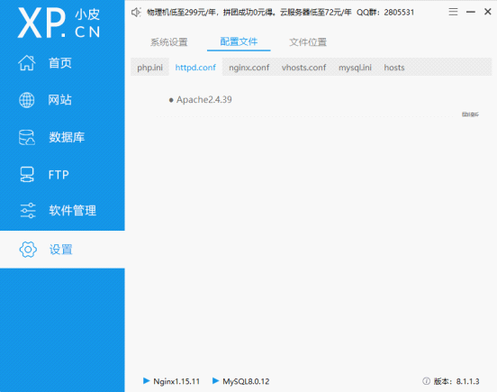

## RabbitMQ Windows下的安装方案

#### 1.Rbbitmq 是基于 Erlang 下运行的，需要下载https://www.erlang.org/downloads 对应的otp版本

#### 下载后直接运行，下一步，选择没有中文的目录下安装，并配置系统环境变量

#### 2.对应的otp https://www.rabbitmq.com/install-windows.html 的 rbbitmq-server 查看 https://www.rabbitmq.com/which-erlang.html

#### 下载地址 https://github.com/rabbitmq/rabbitmq-server/releases

直接安装

#### 3.下载 PHP 扩展 amqp  https://pecl.php.net/package/amqp  版本建议最新

#### 把1 放到对应的php7.4.3 ext 里 并配置php.ini  extension=php_amqp.dll，把2放到 php7.4.3目录里并配置 httpd.conf

#### 把这个放到 httpd.conf 里 LoadFile  "D:/phpstudy_pro/Extensions/php/php7.4.3nts/rabbitmq.4.dll"

#### 重启php，成功 amqp

### 安装3.5 现在 ext-sockets 错误，需要在 php.ini 中开开启 extension=sockets

#### 运行 rbbitmq http://127.0.0.1:15672/#/queues 初始账号密码：guest/guest

## PHP RabbitMQ 使用说明

### 1. 下载 composer require php-amqplib/php-amqplib 3.5 扩展包 注意：需要在php.ini 先启用 extension=sockets 、 extension=mbstring 、extension=php_amqp.dll

#### php-qmqplib Api文档 http://php-amqplib.github.io/php-amqplib/ 
#### RabbitMQ 中文文档 https://rabbitmq.shujuwajue.com/
#### 队列 可以看看 https://packagist.org/packages/enqueue/amqp-lib
#### 参考 https://ziruchu.com/art/530